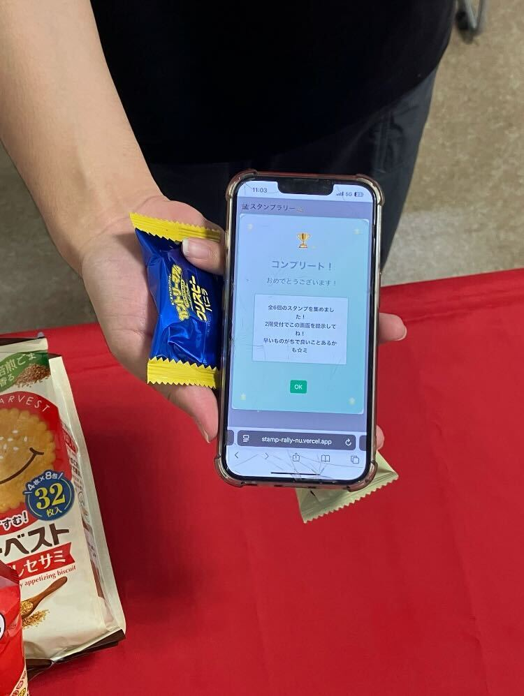
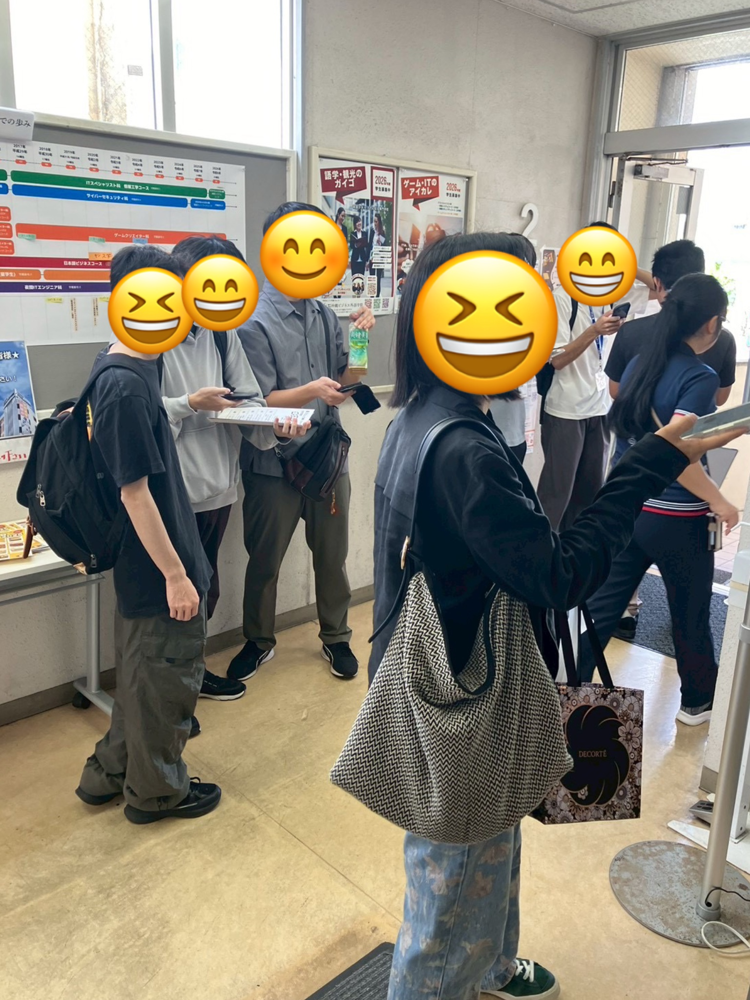
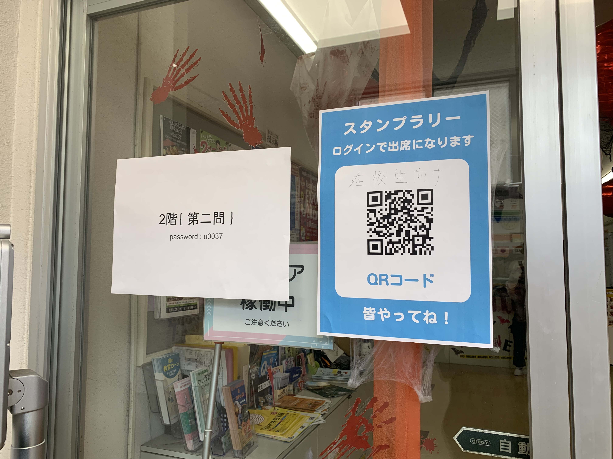

# StampRally
制作日：2年生 10月

## 概要

学校イベントでの学生出席確認を目的に、楽しめるスタンプラリーアプリをチームで制作しました。
受付のQRコードからGoogleログインを行い、データベース登録名で出席を確認。各階のパスワードを使った6問の問題に挑戦し、全問正解者には景品を配布。さらにシークレット問題も用意し、追加景品を提供しました。

## スクリーンショット
↓イベント当日の様子とアプリの実際の動作を動画で載せています。

[（動画）ログインから問題表示・解答](https://drive.google.com/file/d/1DliDLkwg7T3AUbsZsFdrYMZcmWzeupdJ/view?usp=sharingk)

[（動画）コンプリート表示](https://drive.google.com/file/d/1UHC6Ixtu8FDna_e2jJiFtX4CLFvMAR74/view?usp=sharing)

### 機能
* Googleログイン（学生の出席を確認するため）
* クイズ形式のスタンプカード
* 全問正解でコンプリート画面

### ターゲット
* 生徒の出席確認する先生
* イベントに参加した在学生

### エピソード
初めての授業外のチーム開発で、環境構築から手探りで開発を進めました。
また、制作期間が2週間ということもあり、AIも活用しています。イベント当日まで徹夜でアプリ仕上げたことは良い思い出になったと同時に、チームでの開発や、アプリを0から作り上げる大変さを痛感しました。
この経験を活かして効率の良いチーム開発ができるように、もっと開発に慣れていきたいです。

## 使用技術

* 言語: JavaScript, TypeScript, CSS
* フレームワーク: Next.js 15, Bootstrap 5
* ライブラリ: NextAuth.js
* データベース: Supabase
* ORM: Prisma
* デプロイ: Vercel

